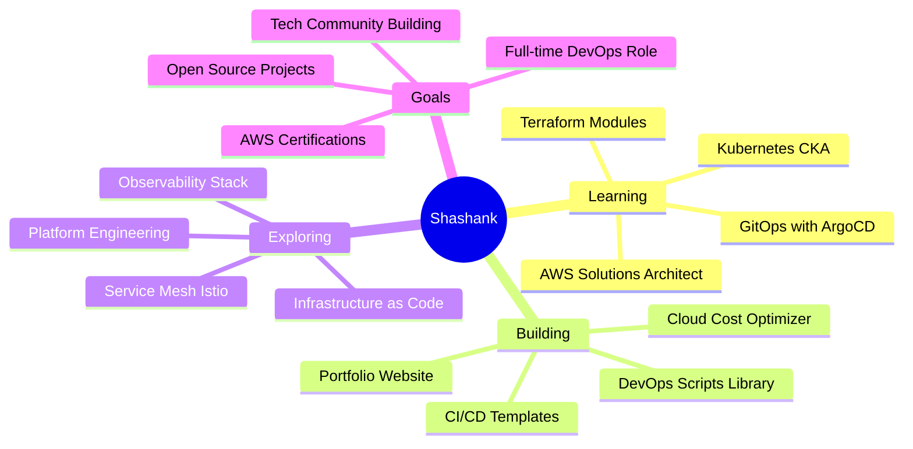

<div align="center">

<!-- Header Banner -->


<!-- Typing Animation -->


<!-- Animated Badges -->
<p>
  
  
  
  
</p>

<!-- Social Stats -->
<p>
  
  
  
</p>

</div>

---

<!-- Animated Divider -->


## 🧑‍💻 About Me

```typescript
const shashank = {
    role: "Final Year B.Tech CSE Student 🎓",
    location: "India 🇮🇳",
    status: "🟢 Open for Opportunities",
    workingOn: {
        current: ["Kubernetes Mastery", "Terraform IaC", "AWS Solutions Architecture"],
        building: ["Cloud Cost Optimizer", "CI/CD Templates", "DevOps Tooling"]
    },
    certifications: ["AWS Cloud Practitioner ☁️"],
    communities: ["Open Source Contributor 🌟"],
    passion: "Transforming complex infrastructure into elegant automation",
    philosophy: "Deploy Fast. Break Nothing. Automate Everything. 🚀"
};
```

<details>
<summary>📊 <b>More About My Journey</b></summary>
<br>

```diff
+ 🔭 Currently exploring Kubernetes, Service Mesh & GitOps
+ 🌱 Learning advanced AWS architecture patterns & Terraform modules
+ 👯 Looking to collaborate on DevOps tools & cloud automation projects
+ 💼 Actively seeking DevOps Engineer / Cloud Engineer roles
+ 💬 Ask me about AWS, Docker, CI/CD pipelines, automation
+ ⚡ Fun fact: I automate everything - even my coffee breaks! ☕
```

</details>


## 🛠️ Tech Stack & Tools

<div align="center">

### ☁️ **Cloud & Infrastructure**

<p>


</p>

### 🔄 **CI/CD & Automation**

<p>


</p>

### 💻 **Development Stack**

<p>


</p>

### 🗄️ **Databases & Tools**

<p>


</p>

</div>


## 🚀 Featured Projects

<div align="center">

<table>
<tr>
<td width="50%" valign="top">

### 📊 AWS Monitoring Dashboard

<a href="https://github.com/itsiiie/aws-monitoring">
  
</a>

**Real-time cloud resource monitoring & cost optimization**

```yaml
features:
  - Free Tier usage tracking
  - Cost forecasting & alerts
  - Multi-service dashboard
  - Budget recommendations
tech: [Python, AWS SDK, Streamlit, Boto3]
```

<p align="center">
  
  
  
</p>

</td>
<td width="50%" valign="top">

### 🔐 Secure File Sharing

<a href="https://github.com/itsiiie/secure-file-sharing-backend">
  
</a>

**Enterprise-grade encrypted file transfer API**

```yaml
features:
  - AES-256 encryption
  - JWT authentication
  - RESTful API design
  - MongoDB integration
tech: [Node.js, Express, MongoDB, JWT]
```

<p align="center">
  
  
  
</p>

</td>
</tr>

<tr>
<td width="50%" valign="top">

### 🛂 Gate Pass System

<a href="https://github.com/itsiiie/Gate-Pass-System">
  
</a>

**Smart campus entry management solution**

```yaml
features:
  - QR code verification
  - Real-time notifications
  - Visitor tracking
  - Admin dashboard
tech: [Python, Tkinter, SQLite, QR]
```

<p align="center">
  
  
  
</p>

</td>
<td width="50%" valign="top">

### ⚡ LatencyLens

<a href="https://github.com/itsiiie/LatencyLens">
  
</a>

**Advanced API performance monitoring tool**

```yaml
features:
  - Real-time latency tracking
  - Performance analytics
  - SLA breach alerts
  - Multi-endpoint support
tech: [Python, Flask, Chart.js, WebSockets]
```

<p align="center">
  
  
  
</p>

</td>
</tr>

<tr>
<td width="50%" valign="top">

### 📦 DevOps Assessment

<a href="https://github.com/itsiiie/devops-assessment">
  
</a>

**Production-ready containerized deployment**

```yaml
features:
  - Multi-container orchestration
  - Automated CI/CD pipeline
  - AWS EC2 deployment
  - Zero-downtime updates
tech: [Docker, GitHub Actions, AWS, Nginx]
```

<p align="center">
  
  
  
</p>

</td>
<td width="50%" valign="top">

### 💾 Cloud Backup System

<a href="https://github.com/itsiiie/personal-cloud-backup">
  
</a>

**Automated S3 backup solution with lifecycle management**

```yaml
features:
  - Scheduled automated backups
  - Compression & encryption
  - S3 lifecycle policies
  - Monitoring dashboard
tech: [Python, AWS S3, Bash, Cron]
```

<p align="center">
  
  
  
</p>

</td>
</tr>
</table>

<a href="https://github.com/itsiiie?tab=repositories">
  
</a>

</div>


## 📊 GitHub Analytics

<div align="center">


<!-- Trophy Stats -->


</div>


## 🏆 Certifications & Achievements

<div align="center">

<table>
<tr>
  <td align="center" width="33%">
    <br>
    <b>AWS Cloud Practitioner</b><br>
    <sub>Coursera • 2024</sub>
  </td>
  <td align="center" width="33%">
    <br>
    <b>Open Source Contributor</b><br>
    <sub>GitHub • 2023-Present</sub>
  </td>
  <td align="center" width="33%">
    <br>
    <b>B.Tech CSE (Final Year)</b><br>
    <sub>2021-2025</sub>
  </td>
</tr>
</table>

</div>


## 🎯 Current Focus

<div align="center">



</div>

<details>
<summary><b>📚 Learning Roadmap 2025</b></summary>
<br>

| Quarter | Focus Area | Goals |
|:---:|:---|:---|
| **Q1** | Kubernetes Deep Dive | CKA Certification, Service Mesh |
| **Q2** | AWS Advanced | Solutions Architect Associate |
| **Q3** | Infrastructure as Code | Terraform, Pulumi, CDK |
| **Q4** | Platform Engineering | Internal Developer Platforms |

</details>


## 🤝 Let's Connect & Collaborate!

<div align="center">

<a href="https://www.linkedin.com/in/itsiiie/">
  
</a>
<a href="https://github.com/itsiiie">
  
</a>
<a href="https://github.com/itsiiie/portfolio">
  
</a>
<a href="mailto:shashanksingh.dev@gmail.com">
  
</a>
<a href="https://twitter.com/itsiiie">
  
</a>

<br><br>

### 💡 Open to Opportunities


</div>


<div align="center">

### 💭 DevOps Wisdom


<br>


**✨ "Automate the Boring. Deploy the Brilliant. Scale the Impossible." ✨**

<br>

[](https://github.com/itsiiie)

</div>
